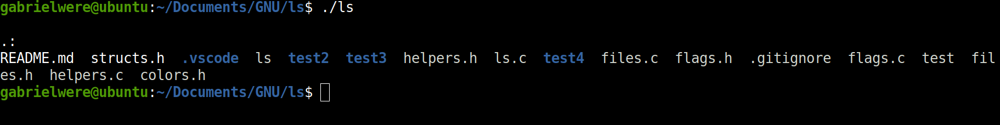
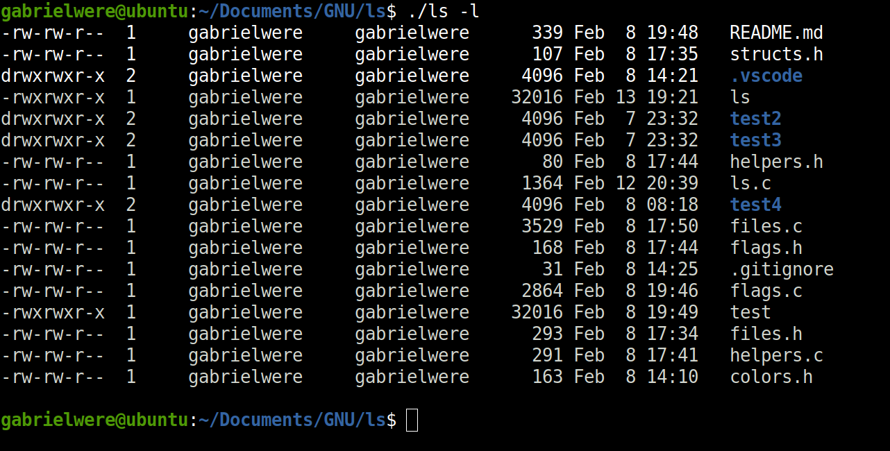
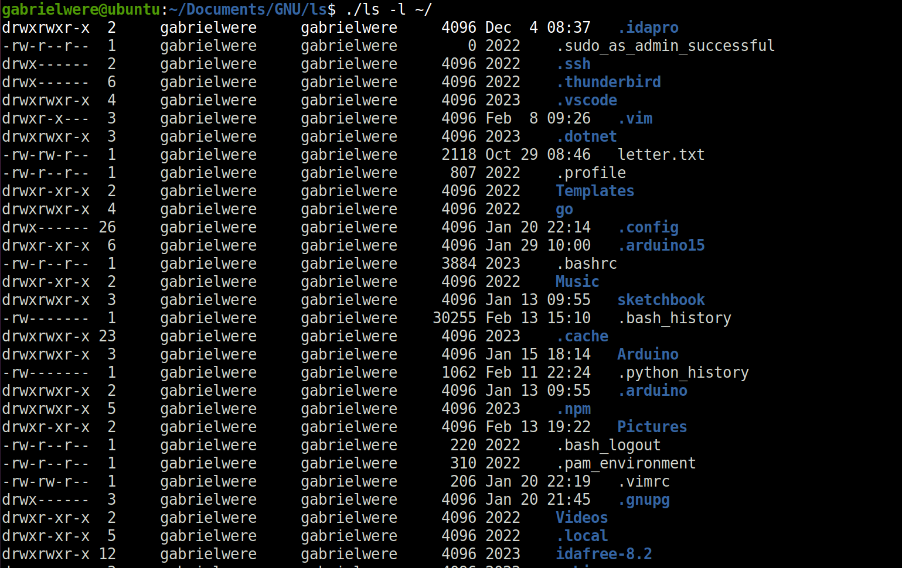

### LS

`ls` command implementation in C

Flags currently implemented :
1. ` -l`
2. `-R`

##### Usage 

```console
cc -g ls.c helpers.c flags.c files.c -o ls
./ls [files | folders] [OPTIONS]
```

##### Examples

```console
./ls
./ls -lR
./ls -l ~/Documents ~/Desktop
./ls -R .
```

Note : Output for the -R flag could use some formatting

### Sample output

#### Sample One

#### Sample Two

#### Sample Three


